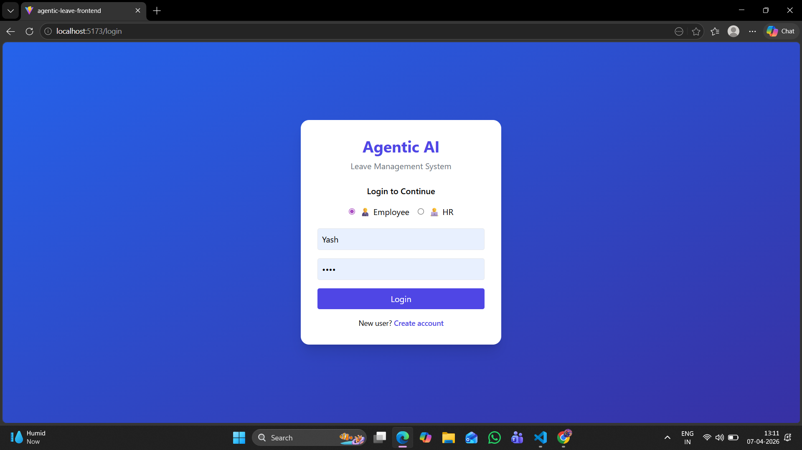
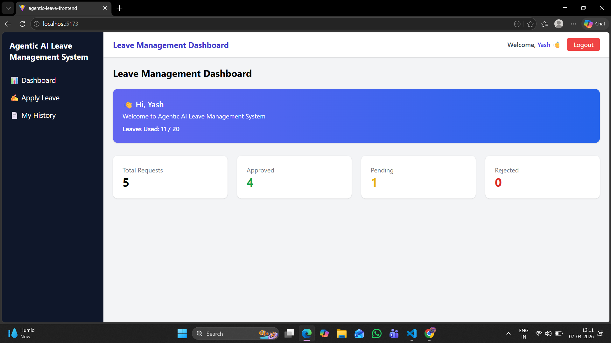
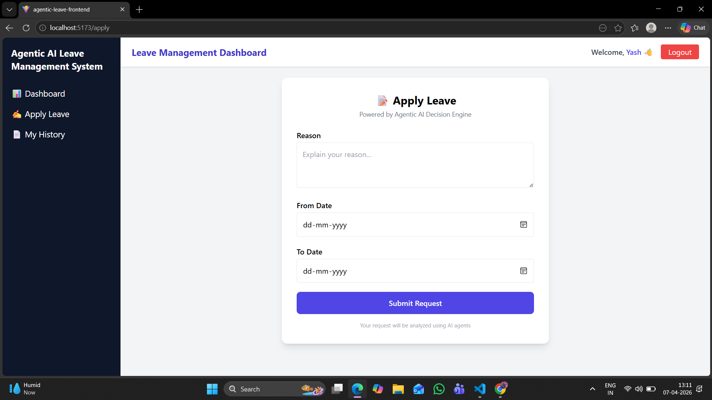
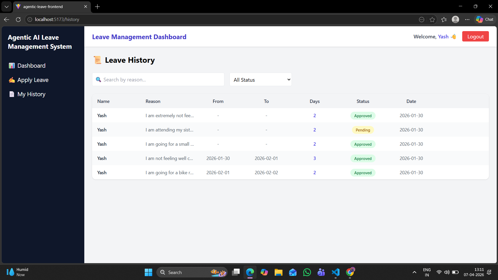
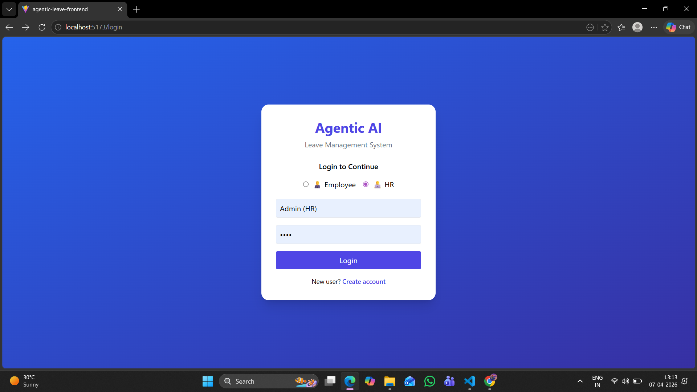
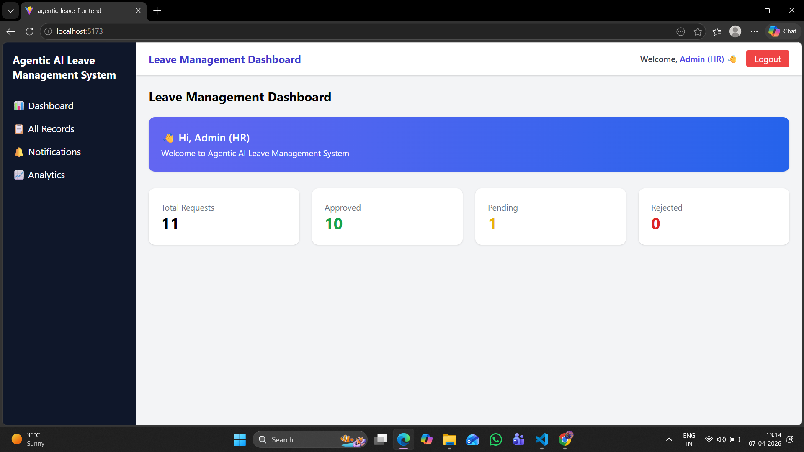
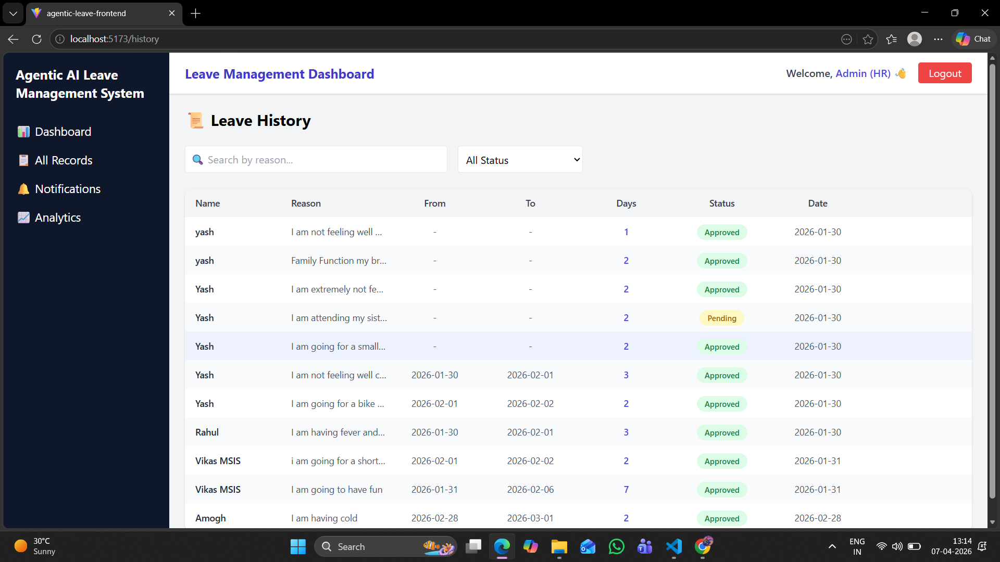
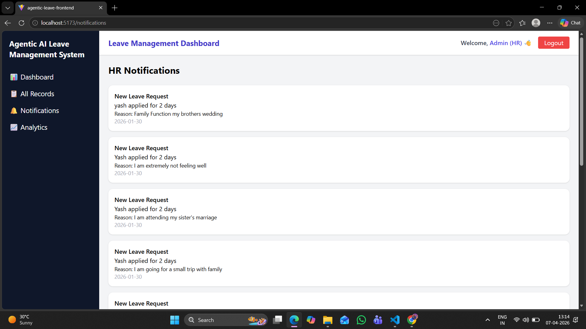
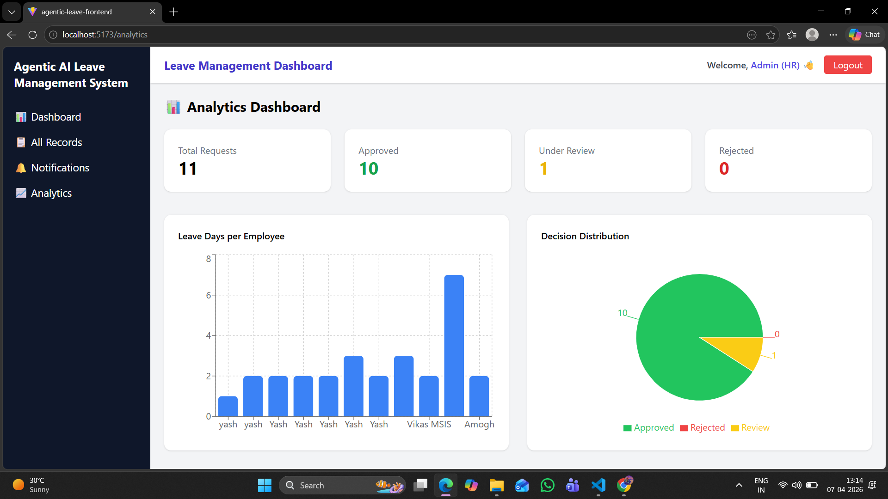

# 🤖 Agentic AI Leave Management System

## 🚀 Overview

The **Agentic AI Leave Management System** is a full-stack intelligent application that automates employee leave workflows using AI-driven decision-making.
It integrates multiple AI agents to analyze leave requests, enforce policies, and provide automated approvals or rejections.

---

## 🧠 Key Highlights

* 🤖 Agentic AI Architecture (Decision + NLP + Policy + Notification)
* 🔐 Secure Authentication using JWT
* 👥 Role-Based Access (Employee / HR)
* 📊 Real-time Dashboard & Analytics
* 📩 Smart Notification System
* ⚡ Automated Leave Decision Engine

---

## 🛠 Tech Stack

### Frontend

* React (Vite)
* Tailwind CSS

### Backend

* Flask (Python)
* REST APIs
* JWT Authentication

### AI Layer

* Decision Agent
* NLP Agent
* Policy Agent
* Notification Agent

### Storage

* JSON-based storage (extendable to MySQL)

---

## 📂 Project Structure

```
Agentic-AI-Leave-System/
│
├── Backend/
│   └── Agentic_Leave_System/
│       │
│       ├── agents/                  # AI agents for decision making
│       │   ├── decision_agent.py
│       │   ├── policy_agent.py
│       │   ├── nlp_agent.py
│       │   └── email_agent.py
│       │
│       ├── memory/                  # Data storage layer (JSON-based)
│       │   ├── memory_store.py
│       │   ├── user_store.py
│       │   ├── notification_store.py
│       │   ├── users.json
│       │   ├── leave_history.json
│       │   └── notifications.json
│       │
│       ├── config/                  # Configuration files
│       │   └── policy.txt
│       │
│       ├── api.py                   # API route definitions
│       ├── main.py                  # Flask app entry point
│       ├── users.json               # Initial user data
│       └── leave_history.json       # Leave records
│
├── Frontend/
│   └── agentic-leave-frontend/
│       │
│       ├── public/                  # Static assets
│       ├── src/
│       │   │
│       │   ├── components/          # Reusable UI components
│       │   │   ├── Header.jsx
│       │   │   ├── Sidebar.jsx
│       │   │   ├── Layout.jsx
│       │   │   └── PrivateRoute.jsx
│       │   │
│       │   ├── pages/               # Application pages
│       │   │   ├── Login.jsx
│       │   │   ├── Register.jsx
│       │   │   ├── Dashboard.jsx
│       │   │   ├── ApplyLeave.jsx
│       │   │   ├── History.jsx
│       │   │   ├── Notifications.jsx
│       │   │   ├── Analytics.jsx
│       │   │   └── Result.jsx
│       │   │
│       │   ├── services/            # API and authentication services
│       │   │   ├── api.js
│       │   │   └── auth.js
│       │   │
│       │   ├── utils/               # Utility functions
│       │   │   └── storage.js
│       │   │
│       │   ├── App.jsx              # Main React component
│       │   ├── main.jsx             # Entry point
│       │   └── index.css            # Global styles
│       │
│       ├── package.json
│       ├── vite.config.js
│       └── tailwind.config.js
│
├── screenshots/                     # UI screenshots for README
│   ├── Employee/
│   │   ├── emp-login.png
│   │   ├── emp-dashboard.png
│   │   ├── emp-apply.png
│   │   └── emp-history.png
│   │
│   └── HR/
│       ├── hr-login.png
│       ├── hr-dashboard.png
│       ├── hr-records.png
│       ├── hr-notifications.png
│       └── hr-analytics.png
│
├── .gitignore
└── README.md
```


## ✨ Features

### 👨‍💼 Employee

* Apply Leave Requests
* View Leave History
* Track Approval Status
* Personalized Dashboard
* AI-based Decision Feedback

### 🧑‍💼 HR/Admin

* View All Employee Records
* Approve / Reject Requests
* Real-time Notifications
* Analytics Dashboard (Charts)
* Organization-level Insights

### 🤖 AI Capabilities

* Policy-based validation
* Automated decision making
* Intelligent workflow handling
* Extendable NLP-based queries

---

## ⚙️ Setup Instructions

### 🔹 Clone Repository

```bash
git clone https://github.com/Yashasgm07/Agentic-AI-Leave-System.git
cd Agentic-AI-Leave-System
```

---

### 🔹 Backend Setup

```bash
cd Backend/Agentic_Leave_System
pip install -r requirements.txt
python main.py
```

---

### 🔹 Frontend Setup

```bash
cd Frontend/agentic-leave-frontend
npm install
npm run dev
```

---

## 🔐 Authentication Flow

* User logs in → JWT token generated
* Token used for protected routes
* Role-based access (Employee / HR)

---

## 🧠 AI Workflow

1. Employee applies for leave
2. Policy Agent validates rules
3. Decision Agent approves/rejects
4. Notification Agent informs HR/Employee
5. Dashboard updates in real-time

---

# 📸 Screenshots

## 👨‍💼 Employee Panel

### 🔐 Login Page


### 📊 Dashboard


### 📝 Apply Leave


### 📜 Leave History

---

## 🧑‍💼 HR/Admin Panel

### 🔐 HR Login


### 📊 HR Dashboard


### 📜 All Records


### 🔔 Notifications


### 📈 Analytics


---

## 🚀 Future Enhancements

* 🌐 Deployment (Vercel + Render)
* 🗄 Database Integration (MySQL / PostgreSQL)
* 📧 Email Notifications (SMTP)
* 🤖 LLM Integration (Chat-based leave assistant)
* 📱 Mobile Responsive UI

---

## 👨‍💻 Author

**Yashas G M**
Software Engineer | AI & Full Stack Developer

---

## ⭐ Support

If you like this project:

* ⭐ Star the repository
* 🍴 Fork it
* 📩 Share feedback

---

## 📌 License

This project is open-source and intended for learning and development purposes.
